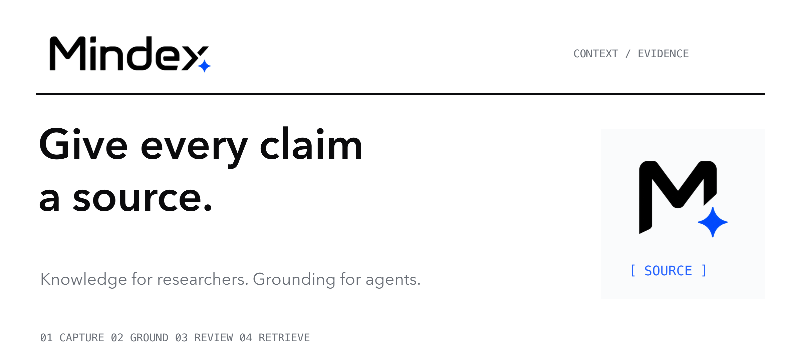
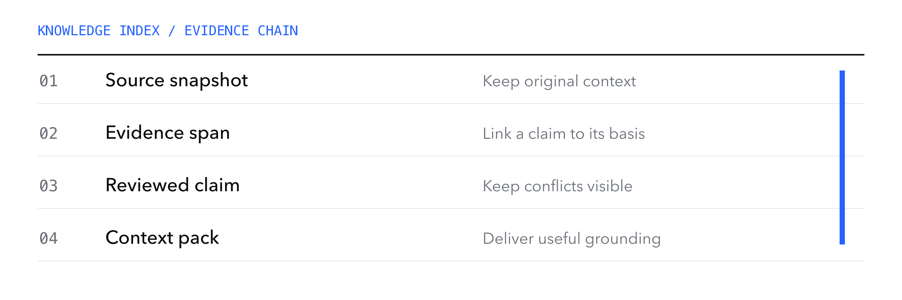
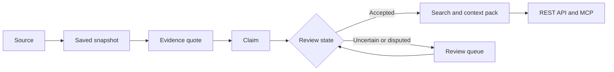

<p align="center"><strong>English</strong> · <a href="README.zh-CN.md">简体中文</a></p>
<p align="center"><a href="#quick-start">Quick start</a> · <a href="docs/architecture.md">Architecture</a> · <a href="docs/evaluation.md">Evaluation</a> · <a href="docs/compliance.md">Source policy</a></p>

# Knowledge your agents can inspect

Mindex is a local knowledge hub for mobile-game advertising research. It turns source material into small, evidence-linked claims, then makes that knowledge available through search, context packs, and MCP.

A researcher can inspect the original text behind a claim. An agent can retrieve the same evidence with its source and review state. Unresolved conflicts stay visible throughout the workflow.



## Built around the evidence

| Capability | What you get |
| --- | --- |
| Source snapshots | A saved version of the material used during extraction. |
| Quote grounding | Checks that an evidence quote can be located in its source snapshot. |
| Confidence and review | Explanations, uncertainty states, and a queue for decisions that need review. |
| Context packs | Structured context with citations and an explicit token budget. |
| REST and MCP | A shared knowledge service for people and downstream agents. |

## How a claim keeps its context



Quote matching checks citation integrity. Source accuracy, whether an excerpt supports a conclusion, and whether sampled opinions represent a wider audience still require separate judgment. Confidence scores are assessment signals, not independently calibrated probabilities.

## Quick start

Use **Node.js 22 or newer** and npm.

```bash
git clone https://github.com/LuvElixir/mindex.git
cd mindex
npm ci
npm run build
npm start
```

Open <http://127.0.0.1:8787> and sign in with the administrator token printed by the service. Configure the model provider and available sources in **Settings**, then create a project and start a research run or import source material.

The data lives in the local `data/` directory. That directory and real credentials belong to your runtime environment.

## Connect an agent

Create a project-scoped API key in the Agent Access page. The service exposes cited search and context-pack endpoints. MCP uses the same REST authorization layer.

| Entry point | Purpose |
| --- | --- |
| `/api/v1/search` | Retrieve knowledge with its citations. |
| `/api/v1/context-pack` | Assemble context for a particular task. |
| `/api/v1/docs` | Browse the local API documentation. |
| `npm run mcp` | Start the stdio MCP adapter with your configured key. |

Connection examples and deployment details are retained in the [technical reference](README.reference.md#agent-接入).

## Development

```bash
npm run dev
npm test
npm run eval
```

Development uses the web interface at port **5173**. Evaluation inspects the configured knowledge database. See [evaluation methods](docs/evaluation.md) for the assertions and boundaries.

| Area | Implementation |
| --- | --- |
| Research and extraction | `server/src/agent/`, `server/src/connectors/` |
| Evidence and knowledge | `server/src/core/`, SQLite |
| Search and integration | `server/src/search/`, `server/src/api/`, `server/src/mcp/` |
| Research interface | `web/`, React and Vite |

## Current scope

Mindex is oriented toward Chinese mobile-game research. Source access depends on the connector, credentials, network, and platform restrictions. Some sources use import workflows. Running without an LLM reduces extraction capability. Read the [source policy](docs/compliance.md) before relying on a connector.

The repository currently has no standalone open-source license file. Public availability should not be read as an unrestricted reuse license.

<p align="center">Built by <a href="https://github.com/LuvElixir">LuvElixir</a> · <a href="https://luckyloading.com/">Luckyloading</a></p>
