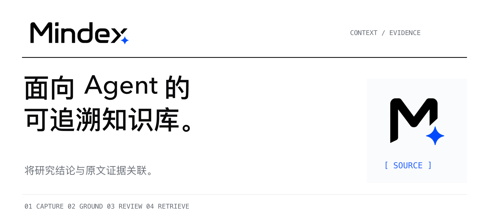
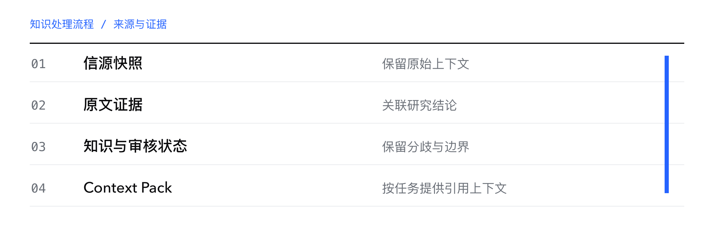
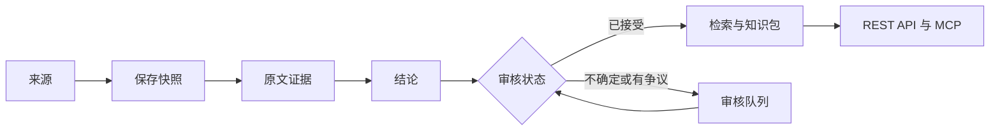

<p align="center"><a href="README.md">English</a> · <strong>简体中文</strong></p>
<p align="center"><a href="#快速开始">快速开始</a> · <a href="docs/architecture.md">架构设计</a> · <a href="docs/evaluation.md">评测方法</a> · <a href="docs/compliance.md">来源策略</a></p>

# 面向 Agent 的可追溯知识库

Mindex 为手游广告研究建立带有来源与审核记录的本地知识库。每条结论都关联抽取时的资料快照和原文证据，研究人员可据此核对引用、审阅判断。

面对不确定或相互冲突的信息，Mindex 保留分歧与审核状态。用于下游任务时，系统按需求和 Token 预算组装 Context Pack，通过 REST 或 MCP 向 Agent 提供带引用的上下文。



## 来源、证据与审核

| 能力 | 作用 |
| --- | --- |
| 来源快照 | 保留知识抽取时使用的资料版本与上下文。 |
| 引文校验 | 检查证据引文能否在来源快照中找到。 |
| 依据与审核 | 查看判断依据，审核有疑问或相互冲突的结论。 |
| Context Pack | 按任务与 Token 预算提供带引用的知识包。 |
| REST 与 MCP | 让人和下游 Agent 使用同一套知识服务。 |

## 知识处理流程



引文校验确认的是引用与快照的一致性。来源可靠性、证据对结论的支持程度，以及样本的代表性，仍需进一步审阅。界面中的置信分数用于辅助审核，尚未经独立概率校准。

## 快速开始

准备 **Node.js 22 或更新版本**与 npm。

```bash
git clone https://github.com/LuvElixir/MindexAI.git
cd MindexAI
npm ci
npm run build
npm start
```

打开 <http://127.0.0.1:8787>，使用服务启动时打印的管理员 Token 登录。在 **设置** 里配置模型和可用来源，然后创建项目，发起研究或导入资料。

数据保存在本地 `data/` 目录。该目录和真实凭据应保留在运行环境中。

## Agent 接入

在「Agent 接入」页面创建限定项目范围的 API Key。服务提供带引用的检索与知识包接口，MCP 复用同一套 REST 鉴权。

| 入口 | 用途 |
| --- | --- |
| `/api/v1/search` | 检索知识与关联引用。 |
| `/api/v1/context-pack` | 按具体任务组装上下文。 |
| `/api/v1/docs` | 浏览本地 API 文档。 |
| `npm run mcp` | 使用已配置的 Key 启动 stdio MCP 适配器。 |

接入示例和部署细节保留在[技术参考](README.reference.md#agent-接入)中。

## 参与开发

```bash
npm run dev
npm test
npm run eval
```

开发界面使用 **5173** 端口。评测会检查配置中的知识库，断言及边界见[评测方法](docs/evaluation.md)。

| 目录 | 内容 |
| --- | --- |
| `server/src/agent/`、`server/src/connectors/` | 研究、抽取与资料来源。 |
| `server/src/core/`、SQLite | 证据与知识管理。 |
| `server/src/search/`、`api/`、`mcp/` | 检索与 Agent 接入。 |
| `web/` | React 与 Vite 研究界面。 |

## 当前范围

Mindex 主要服务国内手游研究。来源可用性取决于连接器、凭据、网络与平台限制，部分来源使用导入流程。没有 LLM 时，抽取能力会降级。使用连接器前请阅读[来源策略](docs/compliance.md)。

仓库目前没有独立的开源许可证文件。公开可见不代表已授予无限制的复用许可。

<p align="center"><a href="https://github.com/LuvElixir">LuvElixir</a> 制作 · <a href="https://luckyloading.com/">Luckyloading</a></p>
